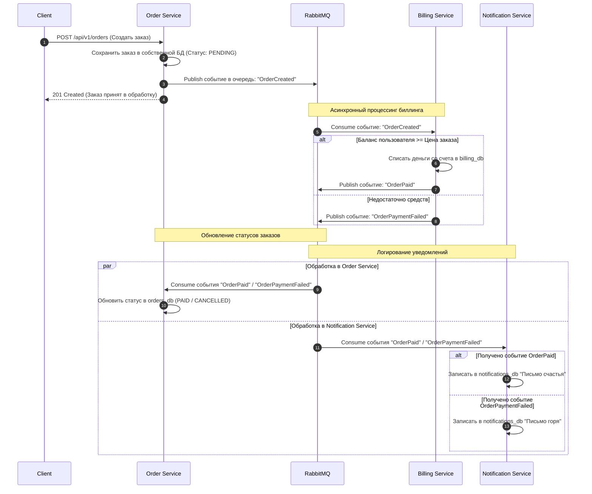

# Централизованное логирование (EFK-стек) и Микросервисная Архитектура

В рамках этого задания монолитное приложение было успешно декомпозировано на **три независимых микросервиса** (`orders-service`, `billing-service`, `notifications-service`). Каждый сервис инструментирован структурированным JSON-логированием (через библиотеку `structlog`), полностью покрывающим все ключевые бизнес-события: старт/стоп приложения, входящие HTTP-запросы, обработку асинхронных сообщений брокера, успешные операции и ошибки.

## Команды для развёртывания инфраструктуры логов

Развёртывание приложения и стека логирования осуществляется в изолированных пространствах имён с помощью Helm-чартов и манифестов:

1. **Создание пространств имён:**
   ```bash
   kubectl create namespace homework
   kubectl create namespace logging
   ```

2. **Развёртывание ELK/EFK стека (Elasticsearch, Fluent Bit, Kibana):**
   ```bash
   helm install elk ./helm/elk-chart -n logging
   ```

## Инструкция по работе в Kibana

1. Получите доступ к веб-интерфейсу Kibana:
   * На Minikube: `minikube service kibana -n logging`
   * На облачном кластере: используйте проброшенный NodePort `30601`.
2. Перейдите в **Stack Management -> Index Patterns** и создайте индекс-паттерн `fluent-bit-logs-*`. В качестве временной метки выберите `@timestamp`.
3. В разделе **Discover** настройте фильтрацию по вашим подам приложения (`kubernetes.pod.name` или полю `service`), чтобы раздельно отслеживать логи от `orders-service`, `billing-service` и `notifications-service`.

---

## Часть 4: Stream Processing и Event Collaboration (Асинхронные заказы)

Для реализации взаимодействия изолированных сервисов Заказов, Биллинга и Нотификаций применён архитектурный паттерн **Event Collaboration** с использованием брокера сообщений **RabbitMQ**. Сервисы слабо связаны и не вызывают друг друга напрямую по HTTP во время обработки транзакции, обмениваясь исключительно бизнес-событиями через очереди.

### Схема взаимодействия микросервисов (Sequence-диаграмма)



### Структура распределенной системы

Каждое приложение является изолированным микросервисом со своей зоной ответственности и собственной базой данных:
* **Billing Service (`billing-service/`)**: Управляет пользователями, их аккаунтами и балансами (`billing_db`). Слушает события создания заказов.
* **Orders Service (`orders-service/`)**: Принимает заказы от клиентов (`orders_db`). Публикует события создания заказов и слушает ответы от биллинга для обновления внутренних статусов.
* **Notifications Service (`notifications-service/`)**: Накапливает историю уведомлений («писем») в собственной БД (`notifications_db`) на основе трансляции успешных/ошибочных событий оплаты.

### Инструкция по развёртыванию и запуску

Развёртывание всей инфраструктуры (включая СУБД PostgreSQL с автоматическим созданием изолированных баз, брокер RabbitMQ и каждый микросервис отдельно) осуществляется из подготовленных манифестов в пространстве имён `homework`:

1. **Запуск всей инфраструктуры и микросервисов одной командой:**
   ```bash
   kubectl apply -f manifests/ -n homework
   ```

2. **Проверка статуса развернутых компонентов:**
   Убедитесь, что все три микросервиса и RabbitMQ запущены в виде независимых подов:
   ```bash
   kubectl get pods -n homework
   ```

3. **Проверка отправленных писем (нотификаций):**
   Для проверки выполнения сценариев тестов Postman и просмотра сохраненных микросервисом сообщений используется выделенный HTTP-эндпоинт сервиса уведомлений (работает строго по ID пользователя): 
   `GET /api/v1/notifications/{user_id}`

