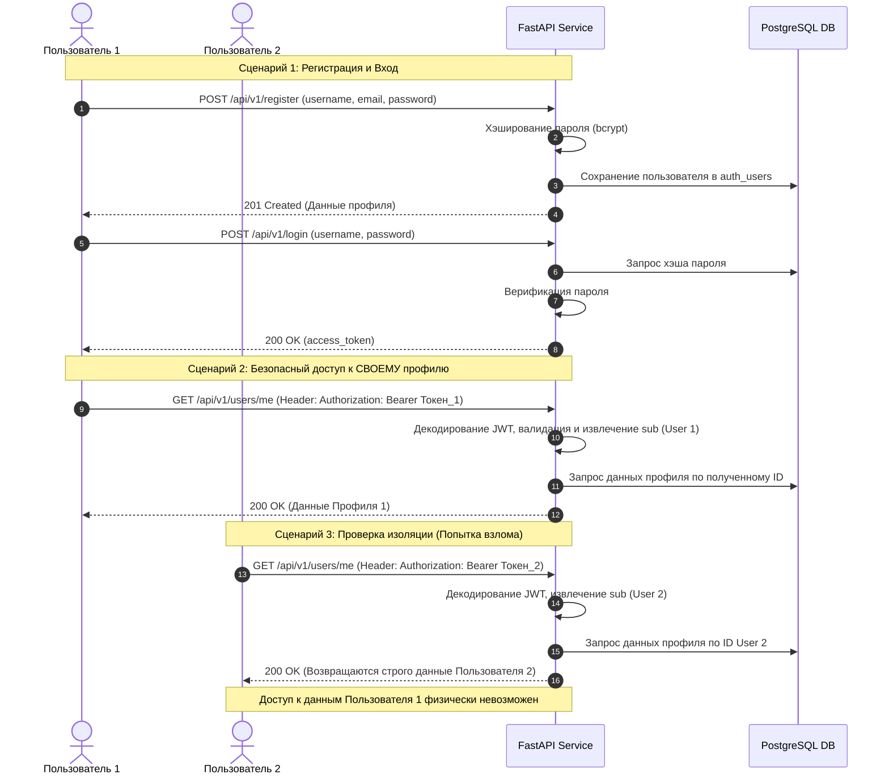

# Проект: RESTful CRUD Микросервис с логированием и авторизацией

---

## 🏗 Часть 1: Аутентификация, авторизация и изоляция данных 

В рамках этого этапа в микросервис была внедрена система аутентификации на базе **JWT (JSON Web Tokens)** и хэширование паролей с помощью алгоритма `bcrypt`. 

### Архитектурное решение
Для обеспечения безопасности и строгой изоляции данных клиентов был реализован защищенный эндпоинт `GET/PUT /api/v1/users/me`. Вместо передачи ID пользователя в URL-адресе, сервис динамически определяет личность пользователя, расшифровывая его персональный JWT-токен из заголовка `Authorization: Bearer <token>`. Данный подход на 100% исключает возможность несанкционированного доступа к чужим профилям.

### 🗺 Схема взаимодействия сервисов (Sequence-диаграмма)



### 🧪 Сценарий автоматического тестирования (Postman/Newman)
В репозитории по пути `postman/postman_collection.json` подготовлена автоматизированная коллекция тестов, проверяющая сценарий:
1. **Регистрация пользователя 1** (Ожидаем `201 Created`).
2. **Попытка доступа к `/users/me` без логина** (Ожидаем `401 Unauthorized`).
3. **Вход пользователя 1** (Сохранение сгенерированного JWT-токена).
4. **Изменение профиля пользователя 1** (Ожидаем `200 OK`).
5. **Проверка изменений** (Валидация обновленных полей профиля 1).
6. **Регистрация и вход пользователя 2** (Получение токена 2).
7. **Проверка изоляции данных** (Пользователь 2 отправляет запрос на `/me` и видит исключительно свой профиль, не имея доступа к данным Пользователя 1).

---

## 🔍 Часть 2: Централизованное логирование (EFK-стек)

Микросервис инструментирован структурированным JSON-логированием (через библиотеку `structlog`), полностью покрывающим все ключевые бизнес-события: старт/стоп приложения, входящие HTTP-запросы, успешные CRUD операции, ошибки валидации и критические сбои СУБД.

### Команды для развёртывания инфраструктуры логов

Развёртывание приложения и стека логирования осуществляется в изолированных пространствах имён с помощью Helm-чартов:

1. **Создание пространств имён:**
   ```bash
   kubectl create namespace otus-msa
   kubectl create namespace logging
   ```

2. **Развёртывание микросервиса (CRUD API):**
   ```bash
   helm install userservice ./helm/user-service -n otus-msa
   ```

3. **Развёртывание ELK/EFK стека (Elasticsearch, Fluent Bit, Kibana):**
   ```bash
   helm install elk ./helm/elk-chart -n logging
   ```

### Инструкция по работе в Kibana

1. Получите доступ к веб-интерфейсу Kibana (на Minikube: `minikube service kibana -n logging`, на облаке: NodePort `30601`).
2. Перейдите в **Stack Management -> Index Patterns** и создайте индекс-паттерн `fluent-bit-logs-*` (Time field: `@timestamp`).
3. В разделе **Discover** настройте фильтрацию по вашему поду приложения (`kubernetes.pod.name`), чтобы отслеживать JSON-структурированные логи уровней INFO, WARN и ERROR.
