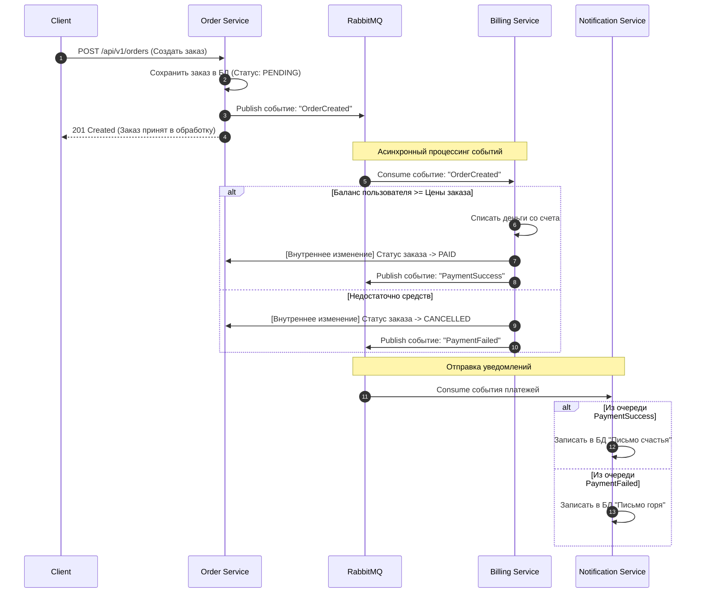

# Централизованное логирование (EFK-стек)

В рамках этого задания CRUD микросервис был инструментирован структурированным JSON-логированием (через библиотеку `structlog`), полностью покрывающим все ключевые бизнес-события: старт/стоп приложения, входящие HTTP-запросы, успешные CRUD операции, ошибки валидации и критические сбои СУБД.

## Команды для развёртывания инфраструктуры логов

Развёртывание приложения и стека логирования осуществляется в изолированных пространствах имён с помощью Helm-чартов:

1. **Создание пространств имён:**
   ```bash
   kubectl create namespace otus-msa
   kubectl create namespace logging
   ```

2. **Развёртывание микросервиса (CRUD API):**
   ```bash
   helm install userservice ./helm/user-service -n otus-msa
   ```

3. **Развёртывание ELK/EFK стека (Elasticsearch, Fluent Bit, Kibana):**
   ```bash
   helm install elk ./helm/elk-chart -n logging
   ```

## Инструкция по работе в Kibana

1. Получите доступ к веб-интерфейсу Kibana:
   * На Minikube: `minikube service kibana -n logging`
   * На облачном кластере: используйте проброшенный NodePort `30601`.
2. Перейдите в **Stack Management -> Index Patterns** и создайте индекс-паттерн `fluent-bit-logs-*`. В качестве временной метки выберите `@timestamp`.
3. В разделе **Discover** настройте фильтрацию по вашему поду приложения (`kubernetes.pod.name` или `service: user-service`), чтобы отслеживать JSON-структурированные логи уровней INFO, WARN и ERROR.

---

## Часть 4: Stream Processing и Event Collaboration (Асинхронные заказы)

Для реализации взаимодействия сервисов Заказов, Биллинга и Нотификаций был выбран архитектурный паттерн **Event Collaboration** с использованием брокера сообщений **RabbitMQ**. 

### Схема взаимодействия сервисов (Sequence-диаграмма)



### Инструкция по развёртыванию и запуску

Все три логических сервиса (Заказы, Биллинг, Нотификации) согласно паттерну Event Collaboration упакованы в единый асинхронный контейнер приложения. Развёртывание всей инфраструктуры (включая СУБД, брокер RabbitMQ и само приложение) осуществляется из стандартных манифестов в пространстве имён `homework`:

1. **Создание пространства имён (если не создано):**
   ```bash
   kubectl create namespace homework
   ```

2. **Запуск всей инфраструктуры одной командой:**
   ```bash
   kubectl apply -f manifests/
   ```

3. **Проверка отправленных писем (нотификаций):**
   Для просмотра сохраненных сообщений («писем счастья» или «писем горя») используется эндпоинт: `GET /api/v1/notifications/{user_id}`.

